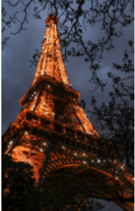

# Image-Transformation

## Aim:

To perform image transformation such as Translation, Scaling, Shearing, Reflection, Rotation and Cropping using OpenCV and Python.

## Software Required:

Anaconda - Python 3.7

## Algorithm:

### Step1:

Import the required packages.

### Step2:

load the image file in the program.

### Step3:

Use the techniques for Translation, Scaling, Shearing, Reflection, Rotation and Cropping using OpenCV and Python.

### Step4:

Display the modified image output.

### Step5:

End the program.


## Program:


Developed By: ABRIN NISHA A

Register Number: 212222230005
```python

import numpy as np
import cv2
import matplotlib.pyplot as plt
input_img=cv2.imread("paris.jpg")
input_img=cv2.cvtColor(input_img,cv2.COLOR_BGR2RGB)
plt.axis('off')
plt.imshow(input_img)
plt.show()
rows,cols,dim=input_img.shape
```

# i)Image Translation:

```python
M=np.float32([[1,0,20],
             [0,1,50],
             [0,0,1]])
translated_img=cv2.warpPerspective(input_img,M,(cols,rows))
plt.axis('off')
plt.imshow(translated_img)
plt.show()
```

# ii) Image Scaling:

```python
M=np.float32([[1.5,0,0],
             [0,2,0],
             [0,0,1]])
scaled_img=cv2.warpPerspective(input_img,M,(cols,rows))
plt.axis('off')
plt.imshow(scaled_img)
plt.show()
```

# iii)Image shearing:

```python
M_x=np.float32([[1,0.2,0],
               [0,1,0],
               [0,0,1]])
M_y=np.float32([[1,0,0],
               [0.4,1,0],
               [0,0,1]])
sheared_img_xaxis=cv2.warpPerspective(input_img,M_x,(cols,rows))
sheared_img_yaxis=cv2.warpPerspective(input_img,M_y,(cols,rows))
plt.axis('off')
plt.imshow(sheared_img_xaxis)
plt.show()
plt.axis('off')
plt.imshow(sheared_img_yaxis)
plt.show()
```

# iv)Image Reflection:

```python
M_x=np.float32([[1,0,0],
               [0,-1,rows],
               [0,0,1]])
M_y=np.float32([[-1,0,cols],
               [0,1,0],
               [0,0,1]])
reflected_img_xaxis=cv2.warpPerspective(input_img,M_x,(cols,rows))
reflected_img_yaxis=cv2.warpPerspective(input_img,M_y,(cols,rows))
plt.axis('off')
plt.imshow(reflected_img_xaxis)
plt.show()
plt.axis('off')
plt.imshow(reflected_img_yaxis)
plt.show()
```

# v)Image Rotation:

```python
angle=np.radians(45)
M=np.float32([[np.cos(angle),-(np.sin(angle)),0],
               [np.sin(angle),np.cos(angle),0],
               [0,0,1]])
rotated_img=cv2.warpPerspective(input_img,M,(cols,rows))
plt.axis('off')
plt.imshow(rotated_img)
plt.show()
```

# vi)Image Cropping:

```python
cropped_img=input_img[20:150,60:230]
plt.axis('off')
plt.imshow(cropped_img)
plt.show()
```
## Output:


### i)Image Translation:


### ii) Image Scaling:


### iii)Image shearing:


### iv)Image Reflection:




### v)Image Rotation:


### vi)Image Cropping:


## Result: 

Thus the different image transformations such as Translation, Scaling, Shearing, Reflection, Rotation and Cropping are done using OpenCV and python programming.
